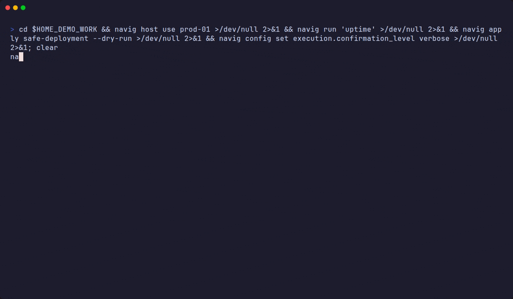

# NAVIG in action

Every recording on this page is a real `navig` session, captured with [VHS](https://github.com/charmbracelet/vhs)
from the tapes in [`tools/showcase/tapes/`](../../tools/showcase/tapes). Nothing is typed into the output and
nothing is edited out — see [How these were recorded](#how-these-were-recorded).

Videos (MP4 + WebM per scene, plus a 90-second trailer) are attached to the
[NAVIG 3.25.0 release](https://github.com/navig-run/core/releases/tag/v3.25.0).

## The 20-second pitch

`navig host list` → a real `navig run` over SSH → `navig apply safe-deployment --dry-run`.

## Live dashboard

`navig dashboard` — this install's identity sigil, services, safety (ledger chain, approvals, host locks), SSH reachability and the latest operations on one live screen. `d` runs `navig doctor` in place; `q` to leave.

## Hosts, and what navig refuses to do

`navig host test` proves the SSH path. A second agent session (`NAVIG_SESSION_ID=agent-b`) is refused while the
first one holds the host. A destructive command asks before it runs — and `n` means no.

## Spaces — a folder becomes a workshop

`navig space init --dry-run` shows the plan, `navig space init` scaffolds it, `navig space doctor` tells you
what is still missing and what to run.

## Blocks — outcomes with receipts

`navig block show safe-deployment` then `navig apply safe-deployment --dry-run`: every step carries its risk,
destructive ones need an explicit `--approve`, and a real apply ends in a verified receipt.

## Skills

`navig skill tree` lists what the agent knows how to do; `navig skill lint` checks a `SKILL.md` against the
authoring standard.

## The operations ledger, and undo

Every command lands on a hash-chained ledger. `navig ledger verify` proves the chain is intact;
`navig undo --list` shows what can be rolled back.

## Store and doctor

`navig store status` — what is wired, what is not. `navig doctor` — the install, section by section, with the
fix next to each finding.

## Your node's identity

`navig whoami` — the GENESIS RECORD: a sigil derived from the node's seed, its machine name and live latency.

## The gateway boots, and stops cleanly

`navig gateway start` — the boot story, phase by phase. `Ctrl+C` — every subsystem drains and reports.

## Built for agents too

`navig --schema` exposes every command as JSON; any listing takes `--json`. Pipe into `jq`, feed to a model.

## How these were recorded

- **Real commands, real output.** Each scene is a VHS tape (`tools/showcase/tapes/*.tape`) run against an
  isolated navig home (`tools/showcase/sandbox.sh`: `NAVIG_CONFIG_DIR` and friends point at a throwaway
  directory). Nothing that appears on screen was pasted, mocked or retouched.
- **The lab hosts are real SSH targets.** `prod-01.lab`, `staging-01.lab` and `db-01.lab` resolve to a
  local `sshd` on port 2222 (`tools/showcase/setup-wsl.sh`) — so `navig run 'df -h /'` is a genuine SSH
  round-trip, and the numbers you see are that machine's. They are labels for a lab box, not production
  servers.
- **Provenance.** [`MANIFEST.json`](MANIFEST.json) records the navig version and commit, the VHS / ffmpeg /
  Chrome builds, the font, and a SHA-256 per asset. `npm run showcase:check` verifies the committed GIFs
  against it.
- **Regenerate.** `npm run showcase:setup` (WSL Ubuntu: VHS, ttyd, ffmpeg, Chrome, the Nerd Font, the lab
  sshd — maintainer tooling that **changes the WSL distro it runs in**; its header lists every change,
  and you never need it to run navig) then `npm run showcase:record`. GIFs land here; MP4/WebM land in `core/.dev/showcase/video/` for the
  release upload, and `npm run showcase:trailer` stitches the trailer.
- **Verified on every push.** `npm run showcase:check` (also a CI step, pure Node — no WSL) fails if a GIF
  no longer matches its manifest entry, if a page embeds one that was never committed, if a recording is
  committed but shown nowhere, if one blows the size budget, if `core/README.md` links one relatively (PyPI
  renders no relative image), or if a tape and its scene have fallen out of step.
- **Before publishing**, `npm run showcase:staleness` says how far the showcased commands have moved since
  these were captured — recordings that lag a redesign are worse than none.
